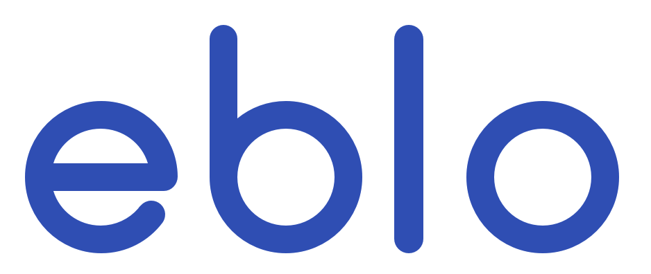

<h3 align="center">
    
</h3>

# Eblo Client
A Fancy Engineering Blogs Reader.

This is the iOS Client for my [Eblo](https://github.com/jindulys/EbloVaporServer) project.

This project is built with **Realm**, **IGListKit**.
NOTE: For now, Realm and IGListKit seems not work very well with each other. My project for now has an bug related to latest blog update. I will use another solution other than IGListKit.

Home page |   Company |  Favs
:-------------------------:|:-------------------------:|:-------------------:
  |   | 

## Installation

Clone this project and then update pods.

    git clone https://github.com/jindulys/Eblo.git
    pod update
    
## Currently Supported Companies

Supported companies         | 
---------------- |
[Yelp](https://engineeringblog.yelp.com/) |
[Artsy](https://artsy.github.io/) |
[Gilt](http://tech.gilt.com) |
[Uber](http://eng.uber.com/) |
[Gusto](http://engineering.gusto.com/) |
[Glow团队技术博客](http://tech.glowing.com/cn/) |
[LinkedIn](https://engineering.linkedin.com/blog) |
[Made Tech](https://www.madetech.com/blog) |
[Azavea](https://www.azavea.com/blog/category/software-development/) |
[Indeed](http://engineering.indeedblog.com/blog/) |
[Spotify](https://labs.spotify.com) |
   
To be continued...

## Contribute
If you are interested to help, you can email me at liyansong.edw@gmail.com

